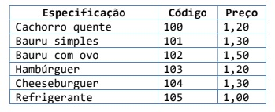
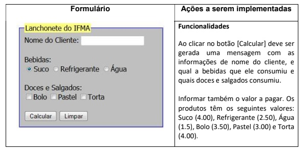

# Laboratório JavaScript

##Descrição
4 problemas que devem ser construídos usando os conceitos de
HTML, CSS e sendo a parte de interatividade implementada com JavaScript.

1. Faça um programa que entre com cinco números e imprima o quadrado de
cada número.
Dica: Use recursos de programação funcional
2. Peça ao usuário para digitar várias idades. Exiba quantas pessoas são
maior de idade (18 anos) e quantas são menores.

3. O cardápio de uma lanchonete é o seguinte:

<i>
    Escrever um programa em Javascript que leia o código do item pedido, a quantidade e calcule
    o valor a ser pago por aquele lanche. Considere que a cada execução somente será calculado
    um item.

    OBS: Deve-se criar os <inputs> para lê os valores do código do item e a quantidade. O resultado deve ser exibido na própria página
</i>

4. Faça um script que receba uma data no formato “dd/mm/aaaa” e escreva a
data por extenso. Dica: use a função “split” de uma string que quebra a string
em pedaços dado um separador como argumento da função. Nesse caso, o
separador é a barra (/) da data. Exemplo: Para a entrada “22/04/2019” deve ser
escrito “22 de abril de 2019”. (Obs.: não necessita de laço de repetição)

5. Desenvolva o formulário com as seguintes ações a serem implementadas:
